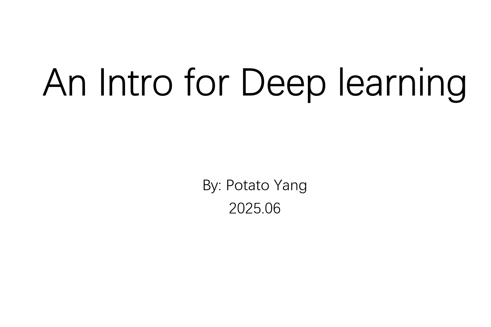
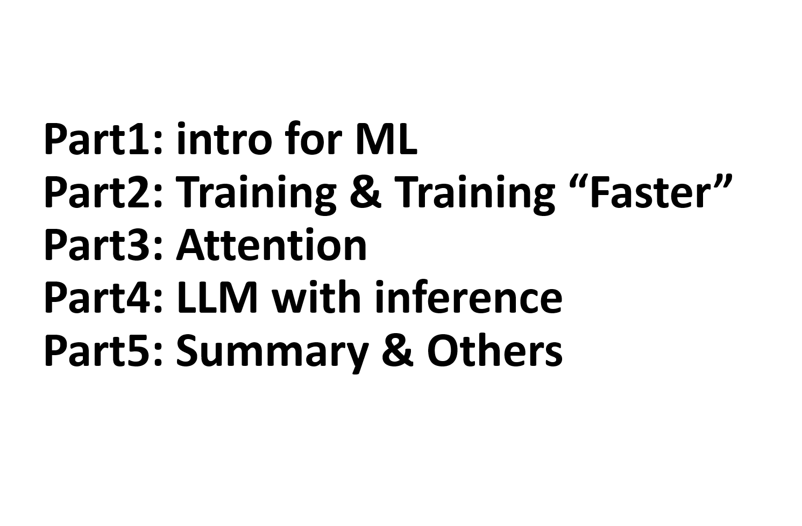
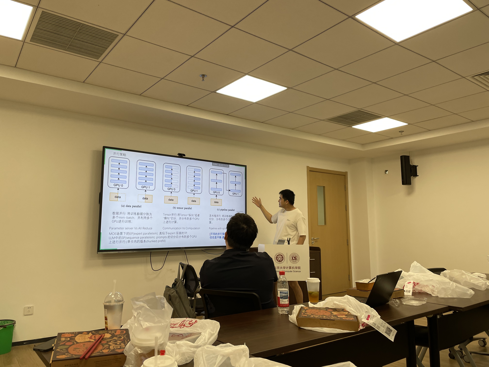
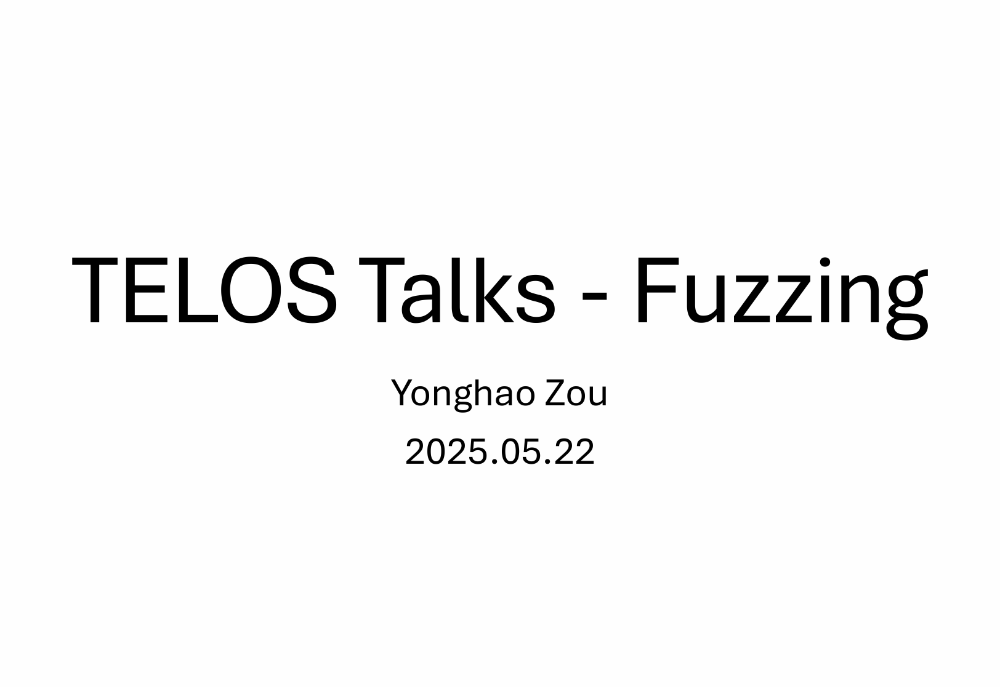
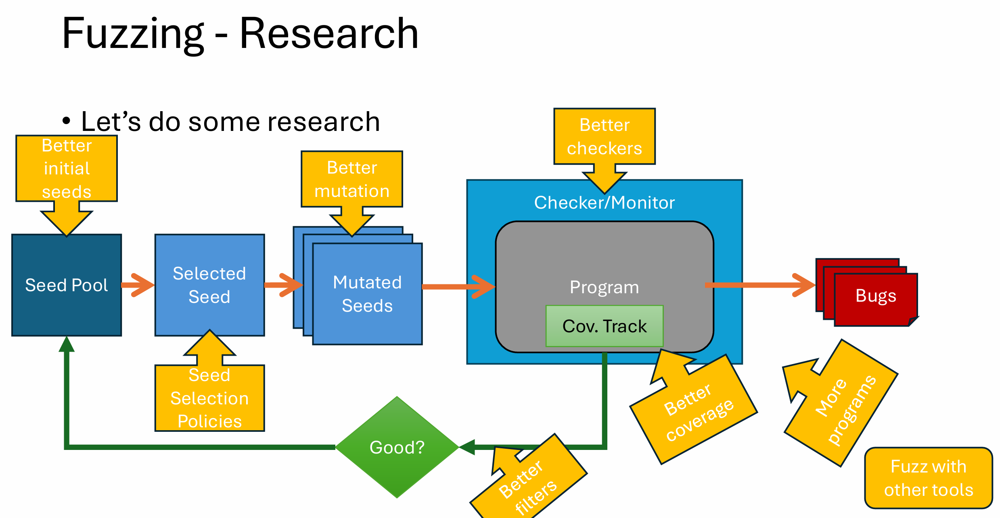

Our code repository is hosted on [GitHub](https://github.com/TELOS-syslab).

We organize TELOS talks, inviting speakers from inside and outside the lab to share their research and insights. The conducted and scheduled talks are listed below:

* 2025-06-13: **Rust in Depth** (Junyang)

* 2025-06-06: **Introduction to ML Sys** (Zehua) [Slides](./talks_slides/ML-intro.pptx)

  

    
    
  

  

    
    
  

* 2025-05-22: **Introduction to Fuzzing** (Yonghao) [Slides](./talks_slides/TELOS%20Talks%20-%20Fuzzing.pdf)

  

    
    
  

