## Research Artifacts

Our code repository is hosted on [GitHub](https://github.com/TELOS-syslab).

## TELOS talks

We organize TELOS talks, inviting speakers from inside and outside the lab to share their research and insights. The conducted and scheduled talks are listed below:

### 2025-06-27: Scheduler

by Zonghao Zhang

  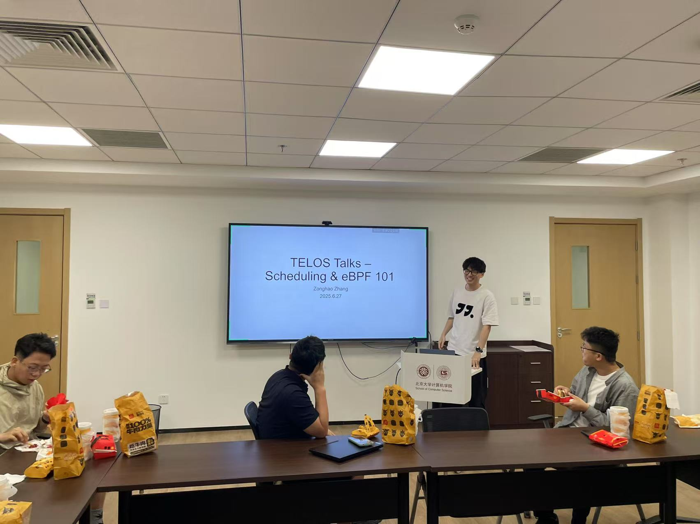
  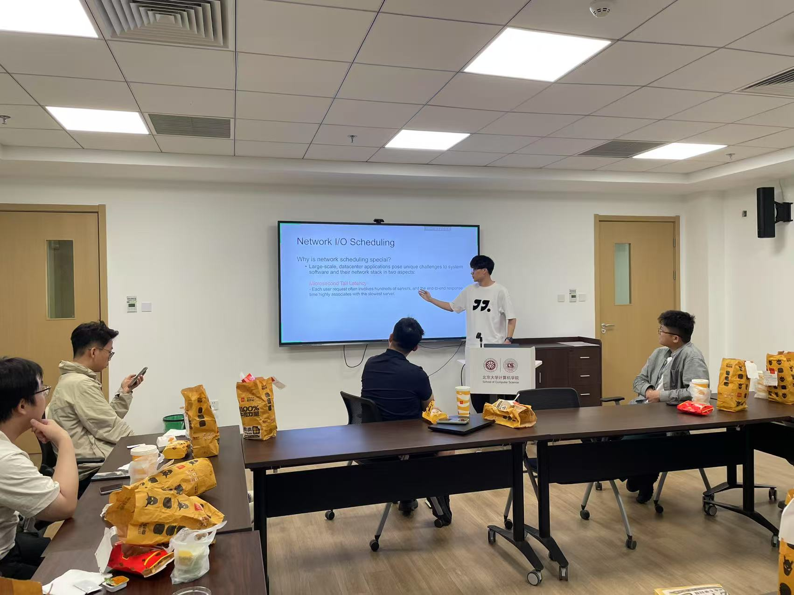
  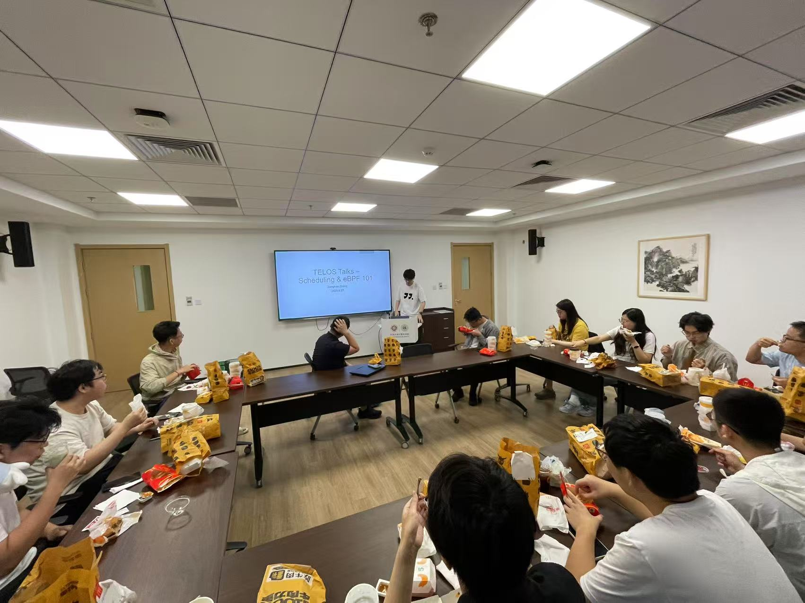

### 2025-06-13: Rust in Depth

By Junyang Zhang

[Slides](./talks_slides/002-Rust.pdf)

  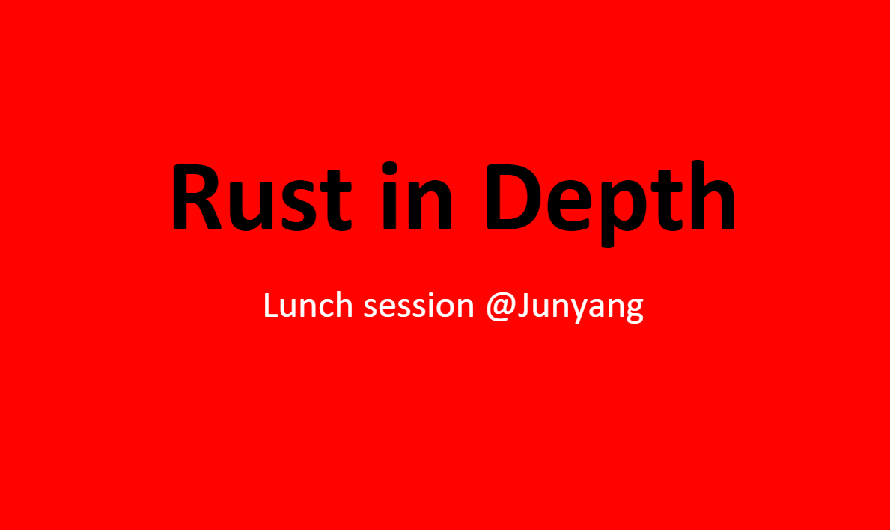
  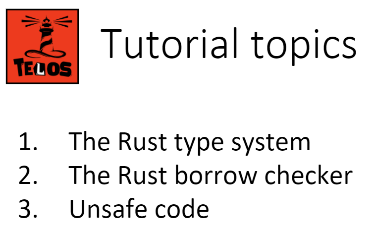

  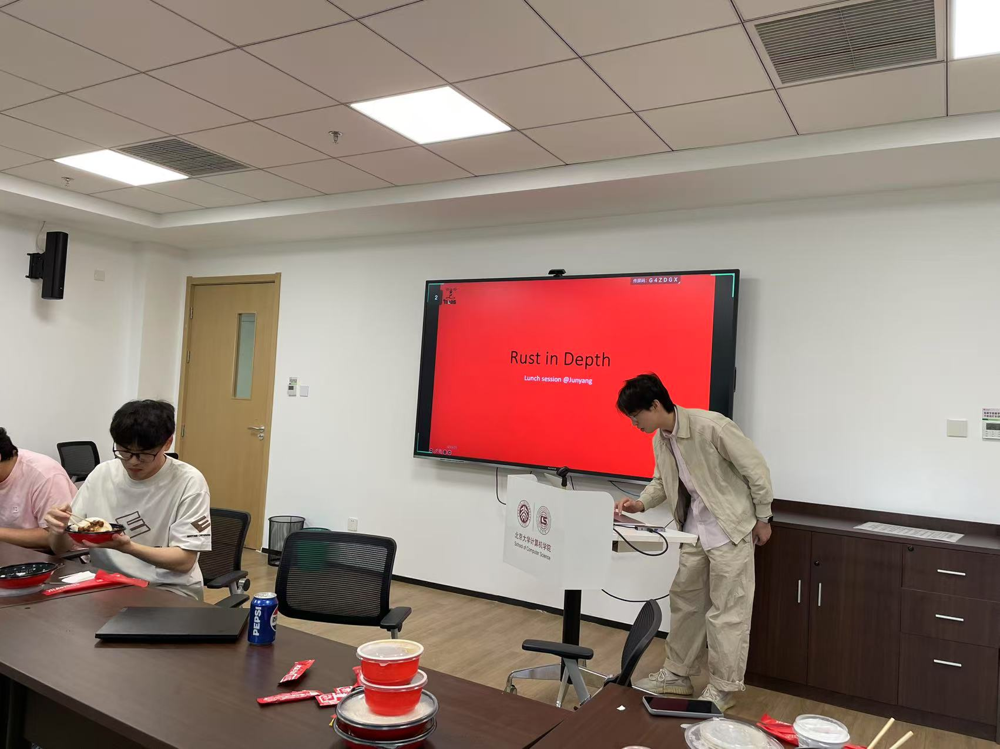
  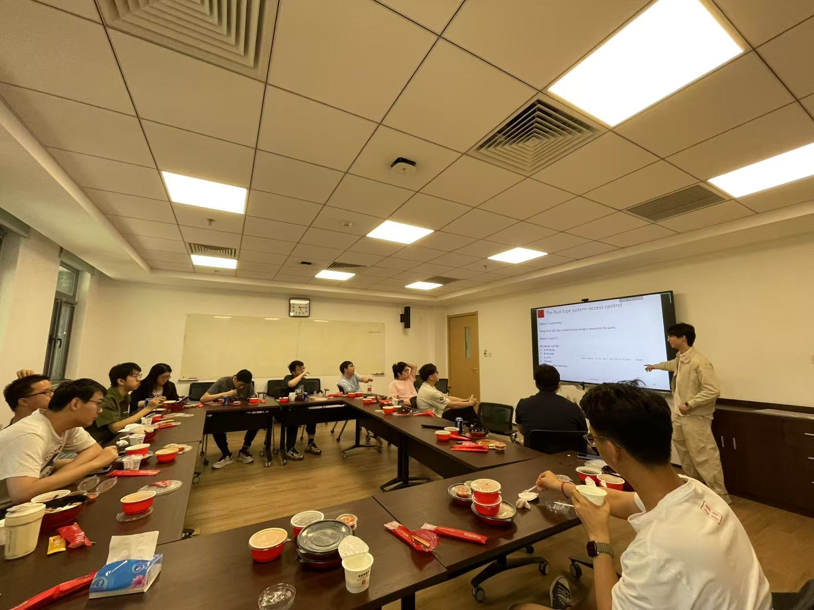

### 2025-06-06: Introduction to ML Sys

By Zehua Yang

[Slides](./talks_slides/001-ML-intro.pptx)

  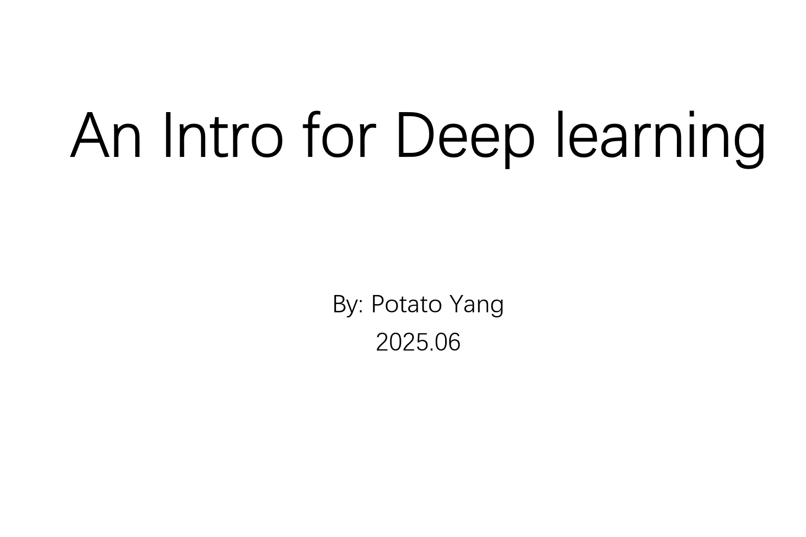
  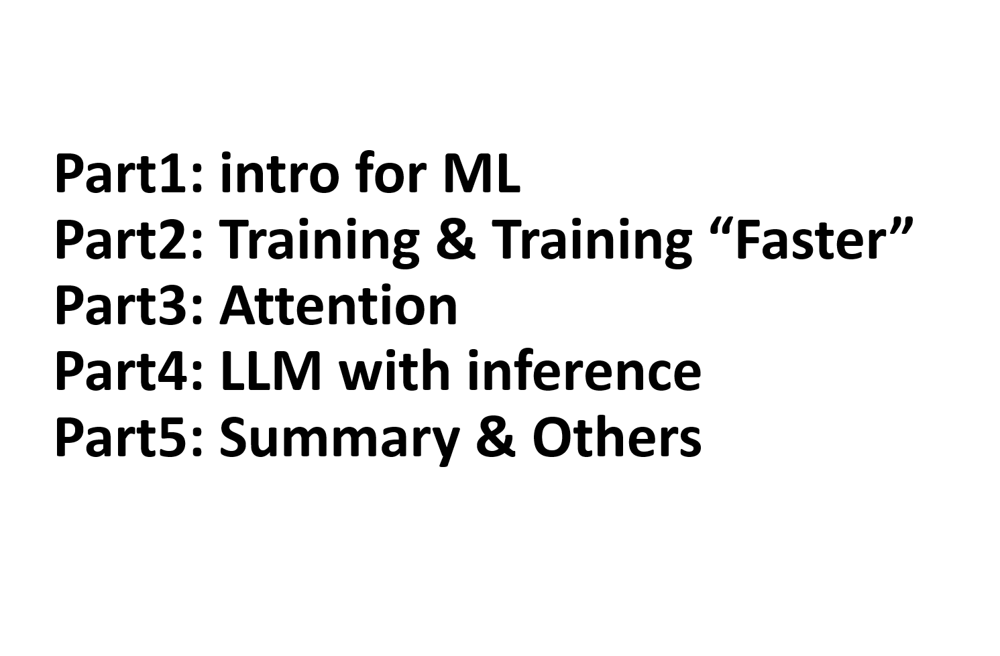

  
  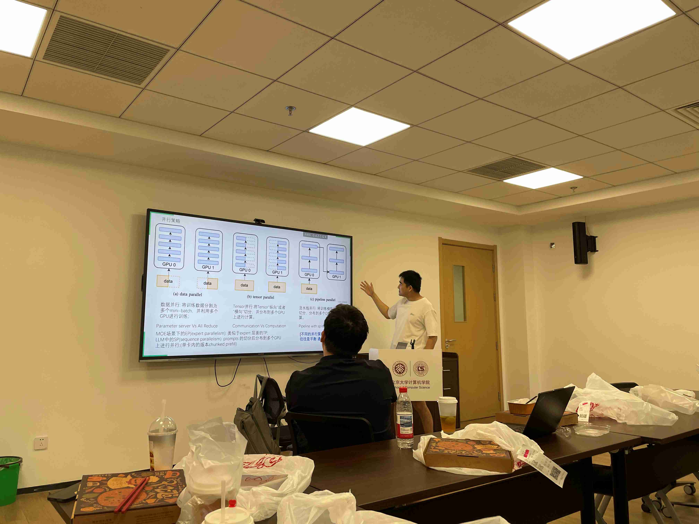

### 2025-05-22: Introduction to Fuzzing

By Yonghao Zou

[Slides](./talks_slides/000-Fuzzing.pdf)

  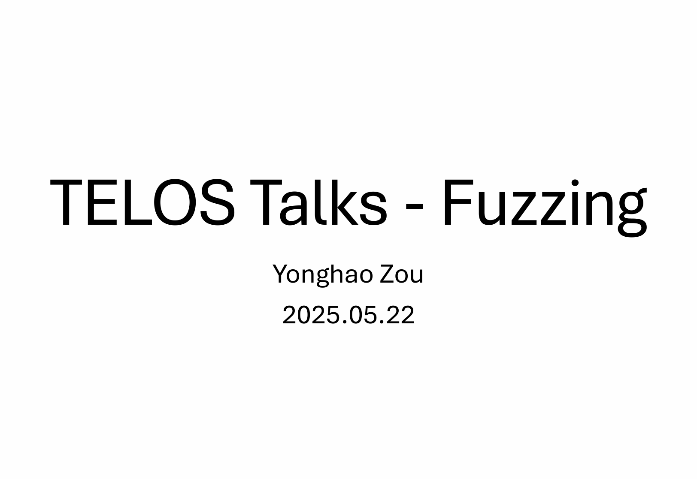
  

